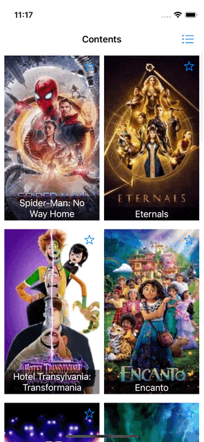

# themovie
## The Movie DB iOS App Example
Sample iOS application presenting usage of MVVM pattern using The Movie DB API.

## Description
Project provides listing movies with two different layouts.  These are also can storable on local database.

Project consuming https://api.themoviedb.org for data source.

## Technical Features
- Using UIKit as interface building using Interface Builder as well as programmatic approach.
- Project splitted to layers as network, business and UI.
- A Separate framework created for networking called RestClient and it's supported by unit tests.

## Environment
- Xcode 13.0
- Swift 5.0
